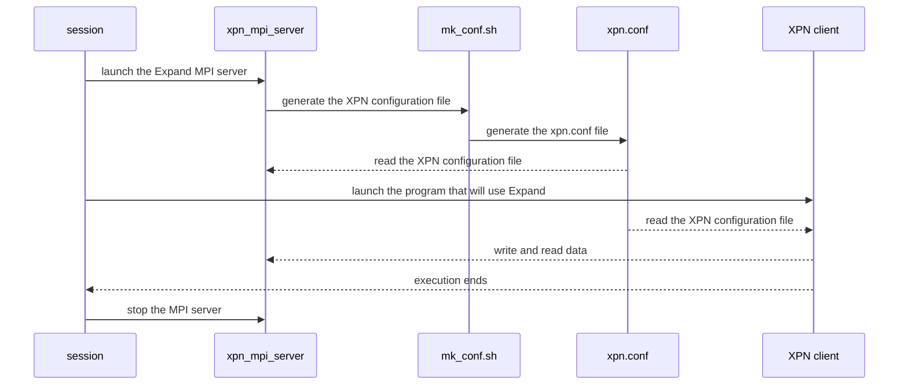

# XPN 2.3.0

*Expand Ad-Hoc Parallel File System*

[](https://opensource.org/licenses/GPL-3.0)

[](https://www.codacy.com/gh/xpn-arcos/xpn/dashboard?utm_source=github.com&amp;utm_medium=referral&amp;utm_content=xpn-arcos/xpn&amp;utm_campaign=Badge_Grade)

* *Homepage*: <https://xpn-arcos.github.io/xpn-arcos.github.io/>
* *Source*:   <https://github.com/xpn-arcos/xpn>
* *Licence*:  [GNU GENERAL PUBLIC LICENSE Version 3](https://github.com/dcamarmas/xpn/blob/master/COPYING)</br>
* *Authors*:  Felix Garcia Carballeira, Luis Miguel Sanchez Garcia, Borja Bergua Guerra, Alejandro Calderon Mateos, Diego Camarmas Alonso, David Garcia Fernandez

## 1. To deploy XPN...

  The Expand Parallel File System (a.k.a. XPN) can be installed on a cluster with local storage per-node (HDD, SSD or RAM Drive) and a shared home directory.

  The general steps to deploy XPN are:
  ```mermaid
  flowchart LR
    A[Start] --> B{Spack?}
    B -- Yes --> C[add repo]
    subgraph ide1 [1.1 With spack]
    C --> D[install software]
    D --> E[load software]
    end
    E --> I[End]
    B -- No ---> F[install prerequisites]
    subgraph ide2 [1.2 With autotools]
    F --> G[download source code]
    G --> H[build source code]
    end
    H --> I[End]
  ```

### 1.1. With Spack

  * To add XPN Spack repository:
    ```
    git clone https://github.com/xpn-arcos/xpn.git
    spack repo add xpn/scripts/spack
    ```

  * To install XPN with Spack:
    ```
    spack info xpn
    spack install xpn
    ```

  * To use XPN with Spack:
    ```
    spack load xpn
    ```


### 1.2. With autotools (configure, make, make install)

  * ### 1.2.1. Installing prerequisites

    XPN needs two elements:
    1. The typical C development tools: gcc, make, autotools
    2. An MPI implementation installed: MPICH or OpenMPI

    The steps to install both depends on your platform (cluster with modules, Linux packages, etc.):

  | Steps to install ...                | Cluster with modules       | Linux packages      |
  | ----------------------------------- | -------------------------- | ------------------- |
  | ... the C development tools         | module load gcc            | sudo apt-get install -y autoconf automake gcc g++ make libtool build-essential |
  | ... the MPI implementation          | module load "impi/2017.4"  | sudo apt-get install -y libmpich-dev mpich mpich-doc                           |
  
  In a cluster with modules, "gcc" is the example of compiler module and "impi/2017.4" is the MPI module.
  You can check your available modules by using:
 ```
 module avail
 ```

 In order to install the MPICH implementation of MPI from source code and with Infiniband (Omni-Path) support we recommend:
 ```
 wget https://www.mpich.org/static/downloads/4.1.1/mpich-4.1.1.tar.gz
 tar zxf mpich-4.1.1
 cd      mpich-4.1.1
 ./configure --prefix=<path where MPICH is going to be installed> \
             --enable-threads=multiple \
             --enable-romio \
             --with-device=ch4:ofi:psm2 \
             --with-libfabric=<path where your libfabric is installed>
 make
 make install
 ```


  * ### 1.2.2. Download the source code of XPN

    You need to download the source code of [XPN](https://xpn-arcos.github.io) and [minixml](http://www.minixml.org).

    You can download both by executing:
    ```
    mkdir $HOME/src
    cd    $HOME/src
    git clone https://github.com/michaelrsweet/mxml.git
    git clone https://github.com/xpn-arcos/xpn.git
    ```

    You must do both 'git clone' requests in the same directory (e.g.: $HOME/src).


  * ### 1.2.3. Building XPN

    To build Expand you need to execute:
    ```
    cd $HOME/src
    ./xpn/build-me -m <full path to your mpicc compiler> \
                   -i <full path to where XPN and MXML are going to be installed>
    ```

## 2. Executing XPN

First, you need to get familiar with 4 special files and 5 special environment variables for XPN client:

  ```mermaid
  mindmap
  root((XPN))
    files
        hostfile
        xpn cfg file
        nameserver
        server file
    environment variables
        XPN_DNS
        XPN_CONF
        XPN_THREAD
        XPN_SESSION
        XPN_LOCALITY
```

The 4 special files are:
* ```<hostfile>``` for MPI, it is a text file with the list of host names (one per line) where XPN servers and XPN client is going to be executed.
* ```<XPN configuration file>``` for XPN, it is a XML file with the configuration for the partition where files are stored at the XPN servers.
* ```<nameserver file>``` for XPN, it will be a text file (created at runtime) with the list of host names where XPN servers are executing.
* ```<server file>``` for XPN is a text file with the list of the servers to be stopped (one host name per line).

And the 5 special environment variables for XPN clients are:
* ```XPN_DNS```      with the full path to the nameserver file to be used (mandatory).
* ```XPN_CONF```     with the full path to the XPN configuration file to be used (mandatory).
* ```XPN_THREAD```   with value 0 for without threads, value 1 for thread-on-demand and value 2 for pool-of-threads (optional, default: 0).
* ```XPN_SESSION```  with value 0 for without session and value 1 for with session (optional, default: 0).
* ```XPN_LOCALITY``` with value 0 for without locality and value 1 for with locality (optional, default: 0).


### 2.1 Ad-Hoc Expand (based on MPI)
The typical executions has 3 main steps:
- First, launch the Expand MPI server (xpn_mpi_server):

  ```
  ./xpn -v -n <number of processes> -l <full path to the hostfile>  start
  ```

- Then,  launch the program that will use Expand (XPN client):

  ```
  mpiexec -np <number of processes> \
          -hostfile <full path to the hostfile> \
          -genv XPN_DNS  <nameserver file> \
          -genv XPN_CONF <XPN configuration file> \
          -genv LD_LIBRARY_PATH <INSTALL_PATH>/mxml/lib:$LD_LIBRARY_PATH \
          -genv LD_PRELOAD      <INSTALL_PATH>/xpn/lib/xpn_bypass.so:$LD_PRELOAD \
          <program path>
  ```

- At the end of your working session, you need to stop the MPI server (xpn_mpi_server):

  ```
  ./xpn -v -l <full path to the hostfile>  stop
  ```
    
Summary:



