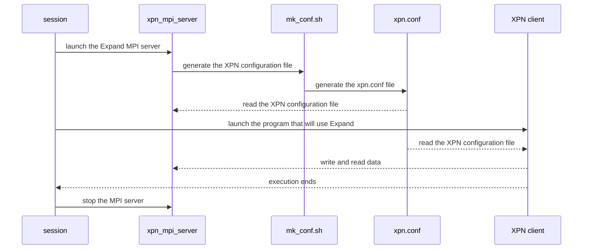

# XPN 2.3.0

*Expand Ad-Hoc Parallel File System*

[](https://opensource.org/licenses/GPL-3.0)

[](https://www.codacy.com/gh/xpn-arcos/xpn/dashboard?utm_source=github.com&amp;utm_medium=referral&amp;utm_content=xpn-arcos/xpn&amp;utm_campaign=Badge_Grade)

* *Homepage*: <https://xpn-arcos.github.io/xpn-arcos.github.io/>
* *Source*:   <https://github.com/xpn-arcos/xpn>
* *Licence*:  [GNU GENERAL PUBLIC LICENSE Version 3](https://github.com/dcamarmas/xpn/blob/master/COPYING)</br>
* *Authors*:  Felix Garcia Carballeira, Luis Miguel Sanchez Garcia, Borja Bergua Guerra, Alejandro Calderon Mateos, Diego Camarmas Alonso, Dario Muñoz Muñoz

## 1. To deploy Ad-Hoc XPN...

  The Expand Parallel File System (a.k.a. XPN) can be installed on a cluster with local storage per-node (HDD, SSD or RAM Drive) and a shared home directory.

  There are only two pre-requisites that current Ad-Hoc XPN needs:
  1. The typical C development tools: gcc, make, and autotools
  2. An MPI implementation installed: MPICH 4.x

  The general steps to deploy XPN are:
  ```mermaid
  %% {init: {"flowchart": {"defaultRenderer": "elk"}} }%%
  flowchart TD
    A([Start]) --> B("Do you have 'Spack'?")
    B -- Yes --> ide11
    B -- No --> Y1("Do you have 'modules'?")

    %% (1) with spack
    subgraph ide1 [1 With spack]
    subgraph ide11 [1.1 Add repo]
       direction TB
       X1["git clone https://github.com/xpn-arcos/xpn.git 
          spack repo add xpn/scripts/spack"]
    end
    subgraph ide12 [1.2 Install software]
       direction TB
       X2["spack <b>info</b> xpn
          spack <b>install</b> xpn"]
    end
    subgraph ide13 [1.3 Load software]
       direction TB
       X3["spack <b>load</b> xpn"]
    end
    classDef lt text-align:left,fill:lightgreen,color:black; 
    class X1,X2,X3 lt;
    ide11 --> ide12
    ide12 --> ide13
    end
    ide13 --> I([End])

    Y1-- Yes --> ide21a
    Y1-- No ---> ide21b
    subgraph ide2 [2 With autotools]
    subgraph ide21a [2.1 Install prerequisites]
       direction TB
       Y1A["module avail <br> module load gcc<br> module load 'impi/2017.4'"]
    end
    subgraph ide21b [2.1 Install prerequisites]
       direction TB
       Y1B["sudo apt-get install -y build-essential gcc make libtool<br>sudo apt-get install -y autoconf automake git<br> sudo apt-get install -y libmpich-dev mpich mpich-doc"]
    end
    subgraph ide22 [2.2 Download source code]
       direction TB
       Y2B["mkdir $HOME/src 
            cd    $HOME/src 
            git clone https://github.com/xpn-arcos/xpn.git"]
    end
    subgraph ide23 ["2.3 build source code"]
       direction LR
       Y3B["export XPN_MPICC='full path to the mpicc compiler to be used' 
            cd $HOME/src 
            ./xpn/build-me -m $XPN_MPICC -i $HOME/bin"]
    end
    ide21a --> ide22
    ide21b --> ide22
    ide22 --> ide23

    classDef lt2 text-align:left,fill:lightblue,color:black;
    class Y1A,Y1B lt2;
    classDef lt3 text-align:left;
    class Y2B,Y3B lt3;
    end

    Y3B --> I([End])
  ```


### With MPICH from source code

 In order to install the MPICH implementation of MPI from source code and with Infiniband (Omni-Path) support we recommend:
 ```
 wget https://www.mpich.org/static/downloads/4.1.1/mpich-4.1.1.tar.gz
 tar zxf mpich-4.1.1
 cd      mpich-4.1.1
 ./configure --prefix=<path where MPICH is going to be installed> \
             --enable-threads=multiple \
             --enable-romio \
             --with-device=ch4:ofi:psm2 \
             --with-libfabric=<path where your libfabric is installed>
 make
 make install
 ```


## 2. Executing Ad-Hoc XPN...

First, you need to get familiar with 4 special files and 1 special environment variables for XPN client:

  ```mermaid
  mindmap
  root((XPN))
    files
        ["`**hostfile**</br>               for MPI, it is a text file with the list of host names (one per line) where XPN servers and XPN client is going to be executed`"]
        ["`**XPN configuration file**</br> for XPN, it is a file with the configuration for the partition where files are stored at the XPN servers`"]
        ["`**nameserver file**</br>        for XPN, it will be a text file (created at runtime) with the list of host names where XPN servers are executing`"]
        ["`**server file**</br>            for XPN, it is a text file with the list of the servers to be stopped (one host name per line)`"]
    environment variables
        ["`**XPN_CONF=**'full path to the XPN configuration file to be used (mandatory)'`"]
```


<details>
<summary>For Expand developers...</summary>
You need to get familiar with 4 special files and 4 special environment variables for XPN client:

  ```mermaid
  mindmap
  root((XPN))
    files
        hostfile
        xpn cfg file
        nameserver
        server file
    environment variables
        XPN_CONF
        XPN_THREAD
        XPN_LOCALITY
        XPN_SCK_PORT
```

The 4 special files are:
* ```<hostfile>``` for MPI, it is a text file with the list of host names (one per line) where XPN servers and XPN client is going to be executed.
* ```<XPN configuration file>``` for XPN, it is a file with the configuration for the partition where files are stored at the XPN servers.
* ```<nameserver file>``` for XPN, it will be a text file (created at runtime) with the list of host names where XPN servers are executing.
* ```<server file>``` for XPN is a text file with the list of the servers to be stopped (one host name per line).

And the 5 special environment variables for XPN clients are:
* ```XPN_CONF```     with the full path to the XPN configuration file to be used (mandatory).
* ```XPN_THREAD```   with value 0 for without threads, value 1 for thread-on-demand and value 2 for pool-of-threads (optional, default: 0).
* ```XPN_LOCALITY``` with value 0 for without locality and value 1 for with locality (optional, default: 0).
* ```XPN_SCK_PORT``` with the port to use in internal comunications (opcional, default: 3456).
</details>


### 2.1 Executing Ad-Hoc Expand (based on MPI)
The typical executions has 3 main steps:
1. First, launch the Expand MPI server (xpn_mpi_server):
   ```bash
   ./xpn -v \
      -n <number of processes> \
      -l <full path to the hostfile> \
      -w <shared directory among hostfile computers, $HOME for example> \
      -x <local directory on each node to be used, /tmp for example> \
      start
   ```
2. Then,  launch the program that will use Expand (XPN client).

   2.1. Example for the *app1* MPI application:
   ```bash
   mpiexec -np <number of processes> \
           -hostfile <full path to the hostfile> \
           -genv XPN_CONF    <XPN configuration file> \
           -genv LD_PRELOAD  <INSTALL_PATH>/xpn/lib/xpn_bypass.so:$LD_PRELOAD \
           <full path to app1>/app1
   ```
   2.2. Example for the *app2* program (a NON-MPI application):
   ```bash
   export XPN_CONF=<full path to the XPN configuration file>
   LD_PRELOAD=<INSTALL_PATH>/xpn/lib/xpn_bypass.so <full path to app2>/app2
   ```
   2.3. Example for the *app3* Python program:
   ```bash
   export XPN_CONF=<full path to the XPN configuration file>
   LD_PRELOAD=<INSTALL_PATH>/xpn/lib/xpn_bypass.so python3 <full path to app3>/app3
   ```
3. At the end of your working session, you need to stop the MPI server (xpn_mpi_server):
   ```bash
   ./xpn -v -l <full path to the hostfile>  stop
   ```

<details>
<summary>For Expand developers...</summary>
Summary:


</details>

