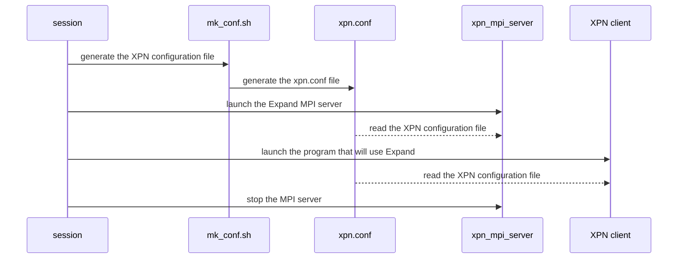
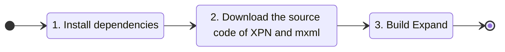

# XPN 2.1

*Expand Ad-Hoc Parallel File System*

[](https://opensource.org/licenses/GPL-3.0)

[](https://www.codacy.com/gh/xpn-arcos/xpn/dashboard?utm_source=github.com&amp;utm_medium=referral&amp;utm_content=xpn-arcos/xpn&amp;utm_campaign=Badge_Grade)

* *Homepage*: <https://xpn-arcos.github.io/xpn-arcos.github.io/>
* *Source*:   <https://github.com/xpn-arcos/xpn>
* *Licence*:  [GNU GENERAL PUBLIC LICENSE Version 3](https://github.com/dcamarmas/xpn/blob/master/COPYING)</br>
* *Authors*:  Felix Garcia Carballeira, Luis Miguel Sanchez Garcia, Borja Bergua Guerra, Alejandro Calderon Mateos, Diego Camarmas Alonso, David Garcia Fernandez

## 1. Installing dependencies

XPN needs the typical C development tools and a MPI implementation installed:
* If you are administrator of your local machine then you need to execute:
  ```
  sudo apt-get install -y <developer packages for gcc, make and MPI>
  ```
* If you are an user of a cluster with already installed software then you might try the following:
  ```bash
  module load <your compiler module>
  module load <your MPI module>
  ```

## 2. Download the source code of XPN

You need to download the source code of [XPN](https://xpn-arcos.github.io/arcos-xpn.github.io/) and [minixml](http://www.minixml.org), you can download both by executing:
```
mkdir $HOME/src
cd    $HOME/src
git clone https://github.com/michaelrsweet/mxml.git
git clone https://github.com/xpn-arcos/xpn.git
```

You must do both 'git clone' requests in the same directory (e.g.: $HOME/src).

## 3. Building XPN

To build Expand you need to execute:
```
cd $HOME/src
./xpn/build-me -m <MPICC_PATH> -i <INSTALL_PATH>
```
Where:
* MPICC_PATH is the full path to your mpicc compiler.
* INSTALL_PATH is the full path of the directory where XPN and MXML are going to be installed.

## 4. Executing XPN

First, you need to get familiar with 4 special files:
* ```<hostfile>``` for MPI, it is a text file with the list of host names (one per line) where XPN servers and XPN client is going to be executed.
* ```<XPN configuration file>``` for XPN, it is a XML file with the configuration for the partition where files are stored at the XPN servers.
* ```<nameserver file>``` for XPN, it will be a text file (created at runtime) with the list of host names where XPN servers are executing.
* ```<server file>``` for XPN is a text file with the list of the servers to be stopped (one host name per line).

Then, you need to get familiar with 5 special environment variables for XPN clients:
* ```XPN_DNS```      with the full path to the nameserver file to be used (mandatory).
* ```XPN_CONF```     with the full path to the XPN configuration file to be used (mandatory).
* ```XPN_THREAD```   with value 0 for without threads, value 1 for thread-on-demand and value 2 for pool-of-threads (optional, default: 0).
* ```XPN_SESSION```  with value 0 for without session and value 1 for with session (optional, default: 0).
* ```XPN_LOCALITY``` with value 0 for without locality and value 1 for with locality (optional, default: 0).


### 4.1 Ad-Hoc Expand (based on MPI)
The typical executions has 3 main steps:
- First, launch the Expand MPI server (xpn_mpi_server):

  ```
  ./xpn -v -n <number of processes> -l <full path to the hostfile>  start
  ```

  To use a thread pool to serve the requests add the -tp flag.

- Then,  launch the program that will use Expand (XPN client):

  ```
  mpiexec -np <number of processes> \
          -hostfile <full path to the hostfile> \
          -genv XPN_DNS  <nameserver file> \
          -genv XPN_CONF <XPN configuration file> \
          -genv LD_LIBRARY_PATH <INSTALL_PATH>/mxml/lib:$LD_LIBRARY_PATH \
          -genv LD_PRELOAD      <INSTALL_PATH>/xpn/lib/xpn_bypass.so:$LD_PRELOAD \
          <program path>
  ```

- At the end of your working session, you need to stop the MPI server (xpn_mpi_server):

  ```
  ./xpn -v -l <full path to the hostfile>  stop
  ```
    
Summary:




## 5. XPN Examples

### 5.1 Debian Linux machine

As an build example scenario we will consider the following one:
* MPI distribution is installed at '/opt/software/install-mpich'
* Installation directory will be '/opt/xpn'




(1) Install dependencies:
  ```
  sudo apt-get install -y autoconf automake gcc g++ make flex libtool doxygen libmpich-dev
  ```

(2) Download the source code of XPN and mxml:
  ```
  mkdir $HOME/src
  cd    $HOME/src
  git clone https://github.com/michaelrsweet/mxml.git
  git clone https://github.com/xpn-arcos/xpn.git
  ```

(3) To build Expand in this case you need to execute:
   ```
   cd $HOME/src
   ./xpn/build-me -m /opt/software/install-mpich/bin/mpicc -i /opt/xpn
   ```


### 5.2 Front-end node of a cluster

Imagine you have a cluter with local storage (HDD, SSD, RAM Drive) per-node and shared home.

As an build example scenario we will consider the following one:
* MPI distribution is installed at '/opt/software/install-mpich'
* Installation directory will be $HOME/xpn_bin


(1) Install dependencies:
  ```
  module available
  module load icc
  module load "impi/2017.4"
  ```

(2) Download the source code of XPN and mxml:
  ```
  mkdir $HOME/src
  cd    $HOME/src
  git clone https://github.com/michaelrsweet/mxml.git
  git clone https://github.com/xpn-arcos/xpn.git
  ```

(3) To build Expand in this case you need to execute:
  ```
  cd $HOME/src;
  ./xpn/build-me -m /opt/software/install-mpich/bin/mpicc -i $HOME/xpn_bin
  ```

