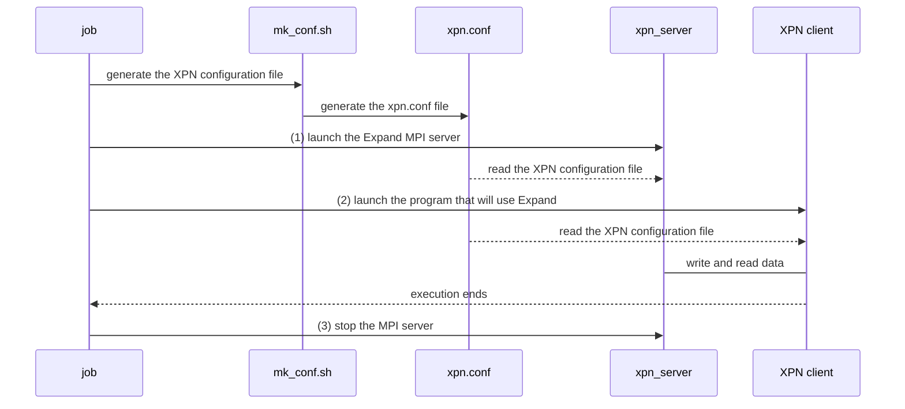

# XPN 3.0.0

*Expand Ad-Hoc Parallel File System*

[](https://opensource.org/licenses/GPL-3.0)

[](https://www.codacy.com/gh/xpn-arcos/xpn/dashboard?utm_source=github.com&amp;utm_medium=referral&amp;utm_content=xpn-arcos/xpn&amp;utm_campaign=Badge_Grade)

* *Homepage*: <https://xpn-arcos.github.io/xpn-arcos.github.io/>
* *Source*:   <https://github.com/xpn-arcos/xpn>
* *Licence*:  [GNU GENERAL PUBLIC LICENSE Version 3](https://github.com/dcamarmas/xpn/blob/master/COPYING)</br>
* *Authors*:  Felix Garcia Carballeira, Luis Miguel Sanchez Garcia, Borja Bergua Guerra, Alejandro Calderon Mateos, Diego Camarmas Alonso, Dario Muñoz Muñoz

## 1. To deploy Ad-Hoc XPN...

  The Expand Ad-Hoc Parallel File System (a.k.a. Ad-Hoc XPN) can be installed on a cluster/supercomputer with:
  1. A local storage per-node (HDD, SSD or RAM Drive) accessible through a directory, ```/tmp``` for example (this will be the NODE_DIR in this document).
  2. A shared directory among compute nodes used, ```$HOME``` for example (this will be the WORK_DIR in this document).

  There are only two software pre-requisites that Ad-Hoc XPN needs:
  1. The typical C development tools: gcc, make, and autotools
  2. An MPI implementation compiled with MPI-IO and threads support:
     * Tested: MPICH 4.1.1 (or compatible) and Intel MPI 2017 (or compatible).
     * Experimental: OpenMPI 5.0.3 (support is experimental).

     If you do not have a compiled MPI implementation with MPI-IO and thread support, <br> still you can compile MPICH or OpenMPI (experimental) from source code:
     * <details>
       <summary>Help to compile MPICH from source code... (click to expand)</summary>
        <br>
        In order to install the MPICH implementation of MPI (for example, MPICH 4.1.1) from source code and with Infiniband (Omni-Path) support we recommend:
    
        ```
        wget https://www.mpich.org/static/downloads/4.1.1/mpich-4.1.1.tar.gz
        tar zxf mpich-4.1.1.tar.gz

        cd mpich-4.1.1
        ./configure --prefix=<path where MPICH is going to be installed> \
                    --enable-threads=multiple \
                    --enable-romio \
                    --with-slurm=<path where your slurm is installed> \
                    --with-device=ch4:ofi:psm2 \
                    --with-libfabric=<path where your libfabric is installed>

        make
        make install

        export LD_LIBRARY_PATH=<path where MPICH is going to be installed>/lib:$LD_LIBRARY_PATH
        ```
       </details>
     * <details>
        <summary>Help to compile OpenMPI from source code... (click to expand)</summary>
        <br>
        For example, in order to install the OpenMPI 5.0.3 implementation of MPI from source code, including Infiniband (Omni-Path) support, we recommend the following steps:
    
        ```
        wget https://download.open-mpi.org/release/open-mpi/v5.0/openmpi-5.0.3.tar.gz
        tar zxf openmpi-5.0.3.tar.gz

        cd openmpi-5.0.3
        ./configure --prefix=<path where Open MPI is going to be installed> \
                    --enable-threads=multiple \
                    --enable-romio \
                    --with-slurm=<path where your slurm is installed> \
                    --with-libfabric=<path where your libfabric is installed>

        make
        make install

        export LD_LIBRARY_PATH=<path where Open MPI is going to be installed>/lib:$LD_LIBRARY_PATH
        ```
       </details>


  Once all prerequisites are met, the general steps to deploy XPN are:
  ```mermaid
  %% {init: {"flowchart": {"defaultRenderer": "elk"}} }%%
  flowchart TD
    A([Start]) --> B("Do you have 'Spack'?")
    B -- Yes --> ide11
    B -- No --> Y1("Do you have 'modules'?")

    %% (1) with spack
    subgraph ide1 [1 With spack]
    subgraph ide11 [1.1 Add repo]
       direction TB
       X1["git clone https://github.com/xpn-arcos/xpn.git 
          spack repo add xpn/scripts/spack"]
    end
    subgraph ide12 [1.2 Install software]
       direction TB
       X2["spack <b>info</b> xpn
          spack <b>install</b> xpn"]
    end
    subgraph ide13 [1.3 Load software]
       direction TB
       X3["spack <b>load</b> xpn"]
    end
    classDef lt text-align:left,fill:lightgreen,color:black; 
    class X1,X2,X3 lt;
    ide11 --> ide12
    ide12 --> ide13
    end
    ide13 --> I([End])

    Y1-- Yes --> ide21a
    Y1-- No ---> ide21b
    subgraph ide2 [2 With autotools]
    subgraph ide21a [2.1 Load prerequisites]
       direction TB
       Y1A["module avail <br> module load gcc<br> module load 'impi/2017.4'"]
    end
    subgraph ide21b [2.1 Install prerequisites]
       direction TB
       Y1B["sudo apt install -y build-essential libtool<br>sudo apt install -y autoconf automake git<br> sudo apt install -y libmpich-dev mpich"]
    end
    subgraph ide22 [2.2 Download source code]
       direction TB
       Y2B["mkdir $HOME/src 
            cd    $HOME/src 
            git clone https://github.com/xpn-arcos/xpn.git"]
    end
    subgraph ide23 ["2.3 build source code"]
       direction LR
       Y3B["export XPN_MPICC='full path to the mpicc compiler to be used' 
            cd $HOME/src 
            ./xpn/build-me -m $XPN_MPICC -i $HOME/bin"]
    end
    ide21a --> ide22
    ide21b --> ide22
    ide22 --> ide23

    classDef lt2 text-align:left,fill:lightblue,color:black;
    class Y1A,Y1B lt2;
    classDef lt3 text-align:left;
    class Y2B,Y3B lt3;
    end

    Y3B --> I([End])
  ```


## 2. Executing Ad-Hoc XPN...

First, you need to get familiar with 2 special files and 1 special environment variables for XPN client:

  ```mermaid
  %%{ init : { "theme" : "default", "themeVariables" : { "background" : "#000" }}}%%
  mindmap
  root(("Ad-Hoc XPN"))
    {{Environment<br> Variables}}
        ["`**XPN_CONF=**'full path to the xpn.conf file' <br> \* It is the XPN configuration file to be used (mandatory)`"]
    {{Files}}
        ["`**hostfile**</br>   \* for MPI, it is a text file with the list of host names (one per line) where XPN servers and XPN client is going to be executed`"]
        ["`**xpn.conf**</br>   \* for Ad-Hoc XPN, it is a text file with the configuration for the partition where files are stored at the XPN servers`"]
```


<details>
<summary>For Expand developers...</summary>
You need to get familiar with 3 special files and 4 special environment variables for XPN client:

  ```mermaid
  %%{ init : { "theme" : "default", "themeVariables" : { "background" : "#000" }}}%%
  mindmap
  root((Ad-Hoc XPN))
    {{Files}}
        [hostfile]
        [xpn.cfg]
        [stop_file]
    {{Environment Variables}}
        [XPN_CONF]
        [XPN_THREAD]
        [XPN_LOCALITY]
        [XPN_SCK_PORT]
```

The 3 special files are:
* ```<hostfile>``` for MPI, it is a text file with the list of host names (one per line) where XPN servers and XPN client is going to be executed.
* ```<xpn.cfg>``` for XPN, it is the XPN configuration file with the configuration for the partition where files are stored at the XPN servers.
* ```<stop_file>``` for XPN is a text file with the list of the servers to be stopped (one host name per line).

And the 4 special environment variables for XPN clients are:
* ```XPN_CONF```     with the full path to the XPN configuration file to be used (mandatory).
* ```XPN_THREAD```   with value 0 for without threads, value 1 for thread-on-demand and value 2 for pool-of-threads (optional, default: 0).
* ```XPN_LOCALITY``` with value 0 for without locality and value 1 for with locality (optional, default: 0).
* ```XPN_SCK_PORT``` with the port to use in internal comunications (opcional, default: 3456).
</details>


### 2.1 Executing Ad-Hoc Expand using MPICH

An example of SLURM job might be:
   ```bash
   #!/bin/bash

   #SBATCH --job-name=test
   #SBATCH --output=$HOME/results_%j.out
   #SBATCH --nodes=8
   #SBATCH --ntasks=8
   #SBATCH --cpus-per-task=8
   #SBATCH --time=00:05:00
   
   export WORK_DIR=<shared directory among hostfile computers, $HOME for example>
   export NODE_DIR=<local directory to be used on each node, /tmp for example>

   scontrol show hostnames ${SLURM_JOB_NODELIST} > $WORK_DIR/hostfile

   # Step 1: to launch the Expand MPI servers
   <INSTALL_PATH>/xpn/bin/xpn -v \
                              -w $WORK_DIR -x $NODE_DIR \
                              -n <number of XPN processes> \
                              -l $WORK_DIR/hostfile start
   sleep 2

     # Step 2: to launch the XPN client (app. that will use Expand)
     mpiexec -np <number of client processes> \
             -hostfile $WORK_DIR/hostfile \
             -genv XPN_CONF    $WORK_DIR/xpn.conf \
             -genv LD_PRELOAD  <INSTALL_PATH>/xpn/lib/xpn_bypass.so:$LD_PRELOAD \
             <full path to the app.>

   # Step 3: to stop the MPI servers
   <INSTALL_PATH>/xpn/bin/xpn -v -d $WORK_DIR/hostfile stop
   sleep 2
   ```


The typical executions has 3 main steps:
1. First, launch the Expand MPI servers:
   ```bash
   export WORK_DIR=<shared directory among hostfile computers, $HOME for example>
   export NODE_DIR=<local directory to be used on each node, /tmp for example>

   <INSTALL_PATH>/xpn/bin/xpn -v \
                              -n <number of processes> \
                              -l $WORK_DIR/hostfile \
                              -w $WORK_DIR \
                              -x $NODE_DIR \
                              start
   ```
2. Then, launch the program that will use Expand (XPN client).
   
   2.1. Example for the *app1* MPI application:
      ```bash
        export WORK_DIR=<shared directory among hostfile computers, $HOME for example>
   
         mpiexec -np               <number of processes> \
                 -hostfile         $WORK_DIR/hostfile \
                 -genv XPN_CONF    $WORK_DIR/xpn.conf \
                 -genv LD_PRELOAD  <INSTALL_PATH>/xpn/lib/xpn_bypass.so:$LD_PRELOAD \
                 <full path to app1>/app1
      ```
   2.2. Example for the *app2* program (a NON-MPI application):
      ```bash
        export WORK_DIR=<shared directory among hostfile computers, $HOME for example>
        export XPN_CONF=$WORK_DIR/xpn.conf
   
        LD_PRELOAD=<INSTALL_PATH>/xpn/lib/xpn_bypass.so <full path to app2>/app2
      ```
   2.3. Example for the *app3.py* Python program:
      ```bash
        export WORK_DIR=<shared directory among hostfile computers, $HOME for example>
        export XPN_CONF=$WORK_DIR/xpn.conf
   
        LD_PRELOAD=<INSTALL_PATH>/xpn/lib/xpn_bypass.so python3 <full path to app3>/app3.py
      ```
4. At the end of your working session, you need to stop the MPI servers:
   ```bash
   export WORK_DIR=<shared directory among hostfile computers, $HOME for example>
   
   <INSTALL_PATH>/xpn/bin/xpn  -v -d $WORK_DIR/hostfile stop
   ```


### 2.2 Executing Ad-Hoc Expand using OpenMPI (experimental alpha)

An example of SLURM job might be:
   ```bash
   #!/bin/bash

   #SBATCH --job-name=test
   #SBATCH --output=$HOME/results_%j.out
   #SBATCH --nodes=8
   #SBATCH --exclusive
   #SBATCH --time=00:05:00

   export WORK_DIR=<shared directory among hostfile computers, $HOME for example>
   export NODE_DIR=<local directory to be used on each node, /tmp for example>

   scontrol show hostnames ${SLURM_JOB_NODELIST} > $WORK_DIR/hostfile

   <INSTALL_PATH>/scripts/execute/xpn.sh -w $WORK_DIR -l $WORK_DIR/hostfile -x $NODE_DIR -n ${SLURM_NNODES} -v mk_conf

   # Step 1
   prte --hostfile $WORK_DIR/hostfile --report-uri $WORK_DIR/prte --no-ready-msg &
   sleep 2
   NAMESPACE=$(cat $WORK_DIR/prte | head -n 1 | cut -d "@" -f 1)

   # Step 2: to launch the Expand MPI servers
   mpiexec -n ${SLURM_NNODES} \
           --hostfile $WORK_DIR/hostfile \
           --dvm ns:$NAMESPACE \
           --map-by ppr:1:node:OVERSUBSCRIBE \
           <INSTALL_PATH>/bin/xpn_server &
   sleep 2

     # Step 3: to launch the XPN client (app. that will use Expand)
     mpiexec  -n <number of processes: 2> \
              -hostfile $WORK_DIR/hostfile \
             --dvm ns:$NAMESPACE \
              -mca routed direct \
             --map-by node:OVERSUBSCRIBE \
              -x XPN_CONF=$WORK_DIR/xpn.conf \
              -x LD_PRELOAD=<INSTALL_PATH>/xpn/lib/xpn_bypass.so:$LD_PRELOAD \
             <full path to the app.>

   # Step 4: to stop the MPI servers
   <INSTALL_PATH>/xpn/bin/xpn -v -d $WORK_DIR/hostfile stop
   sleep 2
   ```


The typical executions has 4 main steps:
1. First, launch the OpenMPI prte server:
  ```bash
   export WORK_DIR=<shared directory among hostfile computers, $HOME for example>
   export NODE_DIR=<local directory to be used on each node, /tmp for example>

   prte --hostfile $WORK_DIR/hostfile --report-uri $WORK_DIR/prte --no-ready-msg &
   NAMESPACE=$(cat $WORK_DIR/prte | head -n 1 | cut -d "@" -f 1)
   ```

2. Second, launch the Expand servers:
   ```bash
   mpiexec -n <number of processes>  -hostfile $WORK_DIR/hostfile \
           --dvm ns:$NAMESPACE \
           --map-by ppr:1:node:OVERSUBSCRIBE \
           <INSTALL_PATH>/bin/xpn_server &
   ```
3. Then, launch the program that will use Expand (XPN client).

   3.1. Example for the *app1* MPI application:
   ```bash
   export WORK_DIR=<shared directory among hostfile computers, $HOME for example>
   
    mpiexec -n <number of processes>  -hostfile $WORK_DIR/hostfile \
            -mca routed direct \
            --map-by node:OVERSUBSCRIBE \
            --dvm ns:$NAMESPACE \
            -genv XPN_CONF    $WORK_DIR/xpn.conf \
            -genv LD_PRELOAD  <INSTALL_PATH>/xpn/lib/xpn_bypass.so:$LD_PRELOAD \
            <full path to app1>/app1
   ```
   3.2. Example for the *app2* program (a NON-MPI application):
   ```bash
   export WORK_DIR=<shared directory among hostfile computers, $HOME for example>
   export XPN_CONF=$WORK_DIR/xpn.conf
   
   LD_PRELOAD=<INSTALL_PATH>/xpn/lib/xpn_bypass.so <full path to app2>/app2
   ```
   3.3. Example for the *app3.py* Python program:
   ```bash
   export WORK_DIR=<shared directory among hostfile computers, $HOME for example>
   export XPN_CONF=$WORK_DIR/xpn.conf
   
   LD_PRELOAD=<INSTALL_PATH>/xpn/lib/xpn_bypass.so python3 <full path to app3>/app3.py
   ```
5. At the end of your working session, you need to stop the Expand servers:
   ```bash
   export WORK_DIR=<shared directory among hostfile computers, $HOME for example>
   
   ./xpn -v -d $WORK_DIR/hostfile stop
   ```


<details>
<summary>For Expand developers...</summary>
<br>
Summary:


</details>

